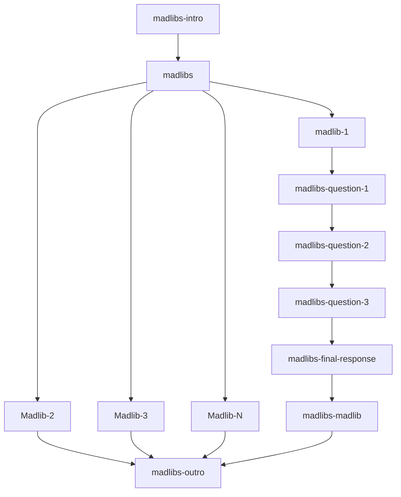

# Madlibs Structure

```mermaid
graph TD

madlibs-intro
madlibs
madlibs-outro


madlibs-intro --> madlibs
madlibs --> madlib-1
madlibs --> Madlib-2 --> madlibs-outro
madlibs --> Madlib-3 --> madlibs-outro
madlibs --> Madlib-N --> madlibs-outro

madlib-1 --> madlibs-question-1
madlibs-question-1 --> madlibs-question-2
madlibs-question-2 --> madlibs-question-3
madlibs-question-3 --> madlibs-final-response
madlibs-final-response --> madlibs-madlib
madlibs-madlib --> madlibs-outro

```
